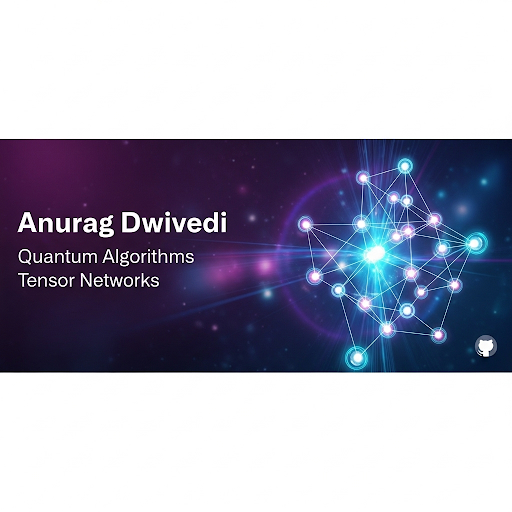

<!-- Banner -->

  

# Hi there 👋, I'm Anurag Dwivedi  

🎓 **PhD Candidate in Chemical Physics** | Indiana University Bloomington  
💡 Researching **distributed quantum computing algorithms with tensor networks**  
🔬 Passionate about **quantum dynamics, quantum algorithms, tensor networks, and high-performance computing**  

---

## 🔭 About Me  
- 🧑‍🔬 Pursuing a **PhD in Chemical Physics** with a focus on **quantum dynamics & quantum information science**  
- 🎓 Dual master’s: **MS in Quantum Information Science (IUB)** & **M.Sc. in Physics (IIT Bombay)** | **B.Sc. (Hons) in Physics (Delhi University)**  
- ⚡ Skilled in **Python (NumPy, SciPy, Qiskit), C++, LaTeX, Shell scripting, and HPC workflows (Slurm, MPI, parallelization)**  
- 📊 Research interests: **quantum algorithms, many-body physics, and scalable optimization methods**  

---

## 🛠️ Skills & Tools  

  
  
  
  
  
  
  

---

## 📈 Current Work  
- 🔹 Developing **tensor network propagation codes** for quantum dynamics  
- 🔹 Exploring **quantum optimization techniques** for scalable simulations  
- 🔹 Running large-scale computations on **HPC clusters (BigRed200, Quartz)**  

---

## 📂 Featured Projects  

🚀 **[QSD_IBM](https://github.com/Anurag6660/QSD_IBM)**  
Implementation of Quantum Shannon Decomposition for unitary circuits in Qiskit with tensor-network extensions.  

⚛️ **[Tensor Network Propagation](#)** *(private / in-progress)*  
Code for propagating quantum dynamics using tensor networks on HPC clusters.  

📊 **[Quantum Dynamics Simulations](#)** *(selected works)*  
Python/C++ based codes for simulating Hamiltonian dynamics with scalable methods.  

---

## 🌐 Connect with Me  

  
  
  

---

⭐ *Always curious about solving hard problems at the intersection of chemistry, physics, computer science, and quantum technologies.*  

---

  

